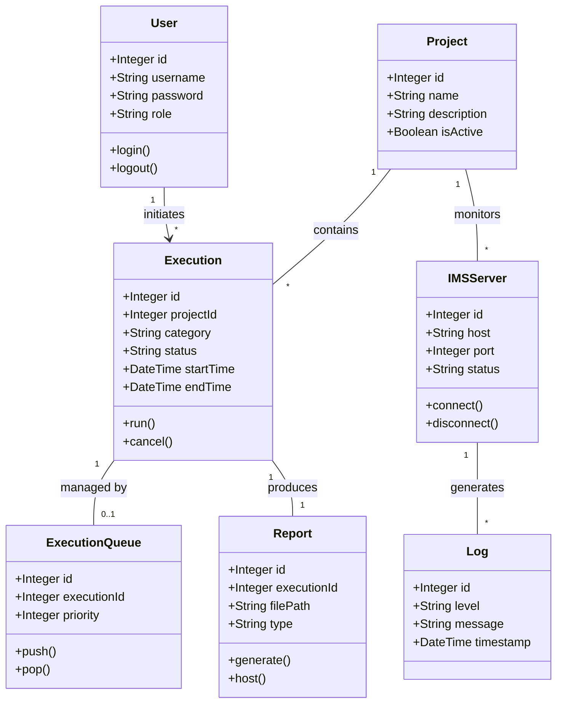

# Class Diagram - AXES Project

The Class Diagram illustrates the main data entities and their relationships within the AXES backend, based on the Sequelize models.

## Entity Descriptions

### 1. User
Represents the system users (Admins, QC Engineers, Developers). Handles authentication and role-based access control.

### 2. Project
A logical grouping for executions and server monitoring. Projects define the context for QC workflows.

### 3. Execution
Represents a single run of a QC script. Tracks its state (pending, running, completed, failed) and categorization (e.g., IPA, TPA).

### 4. ExecutionQueue
Manages the order and priority of executions to be processed by the backend engine.

### 5. Report
The output of an execution. Contains links to the physical report files and metadata about the results.

### 6. IMSServer
Represents a remote server being monitored. Used in regression testing and real-time status tracking via Socket.IO.

### 7. Log
Generic log entity for tracking system events, execution details, and server errors.
