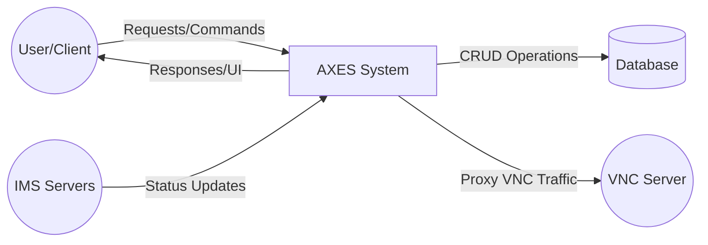
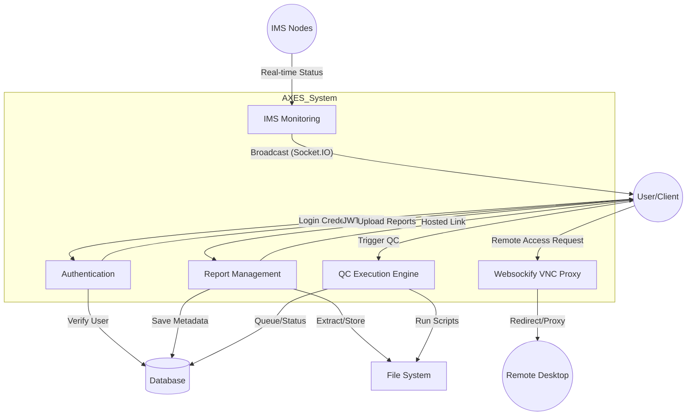

# Data Flow Diagram (DFD) - AXES Project

## 1. Level 0: Context Diagram

The context diagram shows the interaction between the AXES system and external entities.

---

## 2. Level 1: Functional Decomposition

Level 1 breaks down the AXES system into major functional processes.

---

## 3. Data Stores
- **Database**: Stores `users`, `reports`, `execution_history`, `execution_queue`, `projects`, and `ims_servers_configuration`.
- **File System**: Stores physical `.zip` report files, extracted logs, and application logs.
